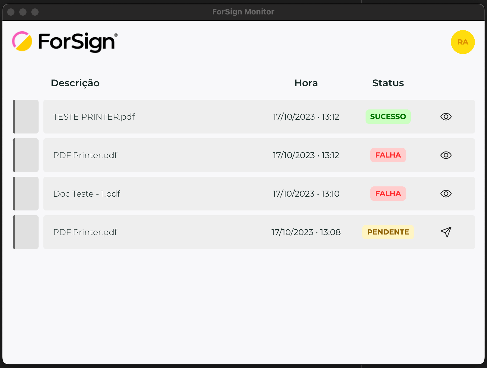

# ForSign Monitor de envios

O **ForSign Monitor** é uma aplicação que simplifica o processo de envio de arquivos para a ForSign, oferecendo monitoramento em tempo real e controle eficiente. Este aplicativo é compatível com sistemas Windows e macOS (Intel).

    

## Requisitos Mínimos

Antes de instalar o aplicativo, certifique-se de que seu sistema atende aos requisitos mínimos abaixo:

| Requisito                  | Mínimo                                      |
| -------------------------- | ------------------------------------------- |
| Sistema Operacional        | Windows 7 SP1 ou superior, ou MacOS (Intel) |
| Memória RAM                | 2GB                                         |
| Processador                | Intel Celeron ou superior                   |
| Espaço em Disco Livre      | 400MB                                       |

## Instalação

### Windows

1. Abra as [releases](https://github.com/forsign-digital/forsign-monitor/releases/latest) e faça download da última versão do app `ForSign Monitor v*.*.* - Setup.exe`.
2. De dois cliques com o botão esquerdo do mouse no arquivo baixado.
3. A instalação irá iniciar e fará todas as configurações necessárias.
4. Ao finalizar, será inserido um atalho na área de trabalho.

### MacOS (Intel) - Em breve

## Configuração

Ao iniciar o aplicativo, você será solicitado a configurar suas credenciais e preferências.

1. **Opção 1: Configuração Manual**
    - Clique em `Abrir` e escolha o diretório que deseja monitorar. 
    - Informe a sua API Key e clique em `Confirmar`. 
    

2. **Opção 2: Login**
    - Clique em "Abrir", escolha o diretório que deseja monitorar e clique em `Fazer login`. 
    - Insira seu e-mail e senha e clique em `Continuar`. 
    - Escolha a conta para a qual deseja se autenticar e clique em `Confirmar`.

## Funcionalidades

### Monitoramento em Tempo Real

O aplicativo mapeia o diretório especificado, monitorando-o continuamente. Quando um novo arquivo PDF é detectado, ele é automaticamente enviado para o ForSign.

### Registro de Envios

Você pode consultar o log de envios, contendo informações como:
- Nome da operação
- Hora de atualização
- Status do envio (Pendente, Sincronizando, Sucesso ou Falha)

### Ações Adicionais

- **Reenvio (Status: Pendente):** Se o status for "Pendente", é possível reenviar o arquivo.
- **Detalhes do Erro (Status: Falha):** Se ocorrer uma falha, é possível consultar os detalhes do erro para solucionar problemas.

### Operações Bem-sucedidas

- **Abrir Operação (Status: Sucesso):** Caso o envio tenha sido bem-sucedido, você pode abrir a operação diretamente do log.
